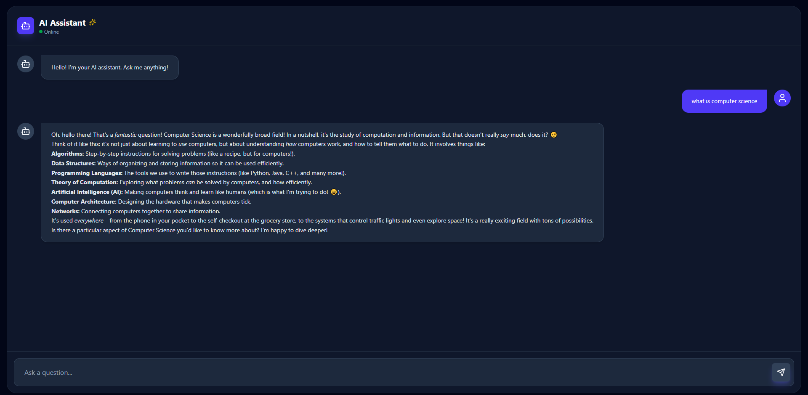

# Rust + React Chatbot

A full‑stack chatbot application with a Rust backend and a React frontend.  
The Rust server exposes a simple HTTP API for chat messages, while the React
single‑page app provides a clean, modern chat interface.

---

## Preview



---

## Features

- 🧠 **AI‑powered chat** – messages are processed on the Rust backend and
  forwarded to an LLM provider.
- ⚙️ **Rust backend API** – type‑safe, fast, and easy to extend.
- 💬 **React chat interface** – modern UI with message bubbles and typing area.
- 🌐 **REST/JSON protocol** – the frontend talks to the backend via JSON over HTTP.
- 🔐 **API key via environment variables** – no secrets in the frontend bundle.

---

## Tech Stack

**Backend**

- Rust
- `axum`
- `tokio` for async runtime
- `reqwest` for calling the LLM provider

**Frontend**

- React
- JavaScript
- Vite
- Tailwind for styling

---

## Architecture

```text
┌──────────────┐       HTTP (JSON)       ┌──────────────┐
│   React UI   │  ───────────────────▶   │Rust Backend │
│  (frontend)  │                         │  /get-answer │
└──────────────┘       AI Provider       └──────────────┘
                                  ▲
                                  │
                         LLM API 